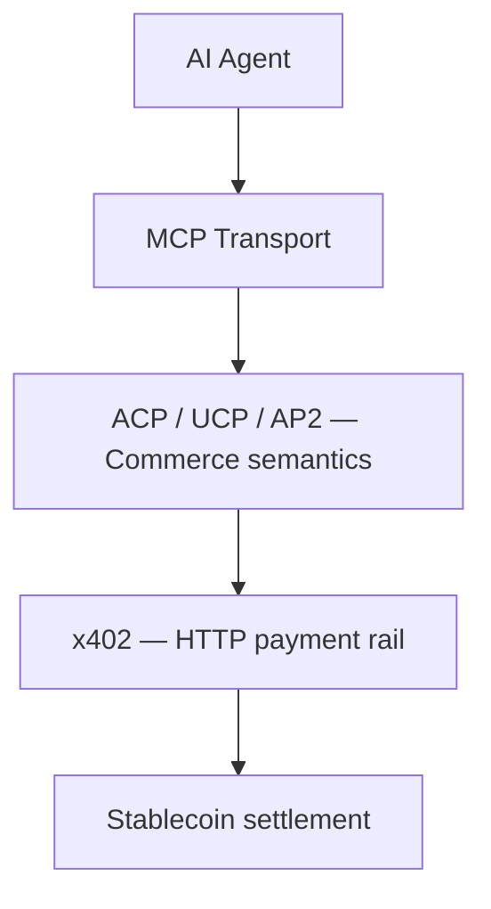

import { Callout } from 'nextra/components'

# Agentic Commerce Protocols at xpay✦

Three open specifications are defining how AI agents transact with merchants on behalf of humans. They overlap heavily and will probably converge on parts of their surface area; for now they're worth understanding separately:

- **[ACP](/agentic-commerce-protocols/acp)** — Agentic Commerce Protocol, maintained by OpenAI and Stripe.
- **[UCP](/agentic-commerce-protocols/ucp)** — Universal Commerce Protocol, a vendor-neutral effort with a Tech Council + Governance Council.
- **[AP2](/agentic-commerce-protocols/ap2)** — Agent Payments Protocol, Google's contribution centered on Agent-to-Agent (A2A) flows.

This section documents each protocol on its own terms, then puts them side-by-side in a single technical comparison page:

- **[ACP vs UCP vs AP2 — Technical Comparison →](/agentic-commerce-protocols/comparison)**

<Callout type="info">
xpay✦ ships an [x402 facilitator](/x402-protocol/facilitator) for stablecoin settlement, an [MCP server](/tools), and contributes upstream to both ACP and UCP. The protocols below sit *above* x402 in the stack: ACP/UCP/AP2 describe the cart-and-checkout semantics, x402 describes the payment rail, and MCP is the transport that lets agents discover and invoke either one.
</Callout>

## How the layers fit

- **MCP** is how agents *discover and call* tools.
- **ACP / UCP / AP2** define *what those tools mean* (a cart, a checkout, an order).
- **x402** is *how the agent pays* once a checkout returns a price.

You can mix and match. ACP today assumes server-side payment processors (Stripe, Adyen). UCP's MCP binding makes it natural to layer x402 underneath. AP2 leans on Google's A2A transport but is payment-rail agnostic.

## Where to go next

- New to all three? Start with the **[comparison page](/agentic-commerce-protocols/comparison)**.
- Building against OpenAI's `Buy It in ChatGPT` surface? See **[ACP](/agentic-commerce-protocols/acp)**.
- Building a multi-vendor agent? See **[UCP](/agentic-commerce-protocols/ucp)**.
- Targeting Google Agent Builder or Gemini agents? See **[AP2](/agentic-commerce-protocols/ap2)**.
