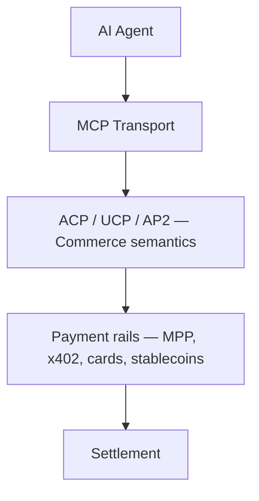

import { Callout } from 'nextra/components'

# Agentic Commerce Protocols at xpay✦

Three open specifications are defining how AI agents transact with merchants on behalf of humans. They overlap heavily and will probably converge on parts of their surface area; for now they're worth understanding separately:

- **[ACP](/agentic-commerce-protocols/acp)** — Agentic Commerce Protocol, maintained by OpenAI and Stripe.
- **[UCP](/agentic-commerce-protocols/ucp)** — Universal Commerce Protocol, a vendor-neutral effort with a Tech Council + Governance Council.
- **[AP2](/agentic-commerce-protocols/ap2)** — Agent Payments Protocol, Google's contribution centered on Agent-to-Agent (A2A) flows.

This section documents each protocol on its own terms, then puts them side-by-side in a single technical comparison page:

- **[ACP vs UCP vs AP2 — Technical Comparison →](/agentic-commerce-protocols/comparison)**

<Callout type="info">
xpay✦ contributes upstream to ACP and UCP, runs an [MCP server](/tools) for tool discovery, and integrates with multiple payment rails so merchants aren't locked into one. The commerce protocols below are rail-agnostic by design — pick the cart/checkout semantics that fit, then plug in whatever payment rail your buyers use.
</Callout>

## How the layers fit

- **MCP** is how agents *discover and call* tools.
- **ACP / UCP / AP2** define *what those tools mean* (a cart, a checkout, an order).
- **Payment rails** are *how the agent pays* once a checkout returns a price. Rail choice is independent of the commerce protocol: cards, stablecoins via [x402](/x402-protocol), Stripe's [MPP](https://mpp.dev), Adyen, ACH, whatever fits the merchant.

Mix and match freely. ACP today assumes server-side processors (Stripe, Adyen). UCP's MCP binding composes cleanly with any rail. AP2 leans on Google's A2A transport and is itself rail-agnostic.

## For merchants

Just want to accept agent-driven purchases without picking a protocol yourself?

- [xpay.sh/merchants](https://www.xpay.sh/merchants/) — overview for retailers
- [Shopify](https://www.xpay.sh/merchants/shopify) — drop-in for Shopify stores
- [WooCommerce](https://www.xpay.sh/merchants/woocommerce/) — landing page · [setup guide in these docs](/merchants/woocommerce)

## Where to go next

- New to all three? Start with the **[comparison page](/agentic-commerce-protocols/comparison)**.
- Building against OpenAI's `Buy It in ChatGPT` surface? See **[ACP](/agentic-commerce-protocols/acp)** (or the [xpay.sh/protocols/acp](https://www.xpay.sh/protocols/acp/) overview).
- Building a multi-vendor agent? See **[UCP](/agentic-commerce-protocols/ucp)** (or [xpay.sh/protocols/ucp](https://www.xpay.sh/protocols/ucp/)).
- Targeting Google Agent Builder or Gemini agents? See **[AP2](/agentic-commerce-protocols/ap2)** (or [xpay.sh/protocols/ap2](https://www.xpay.sh/protocols/ap2/)).
