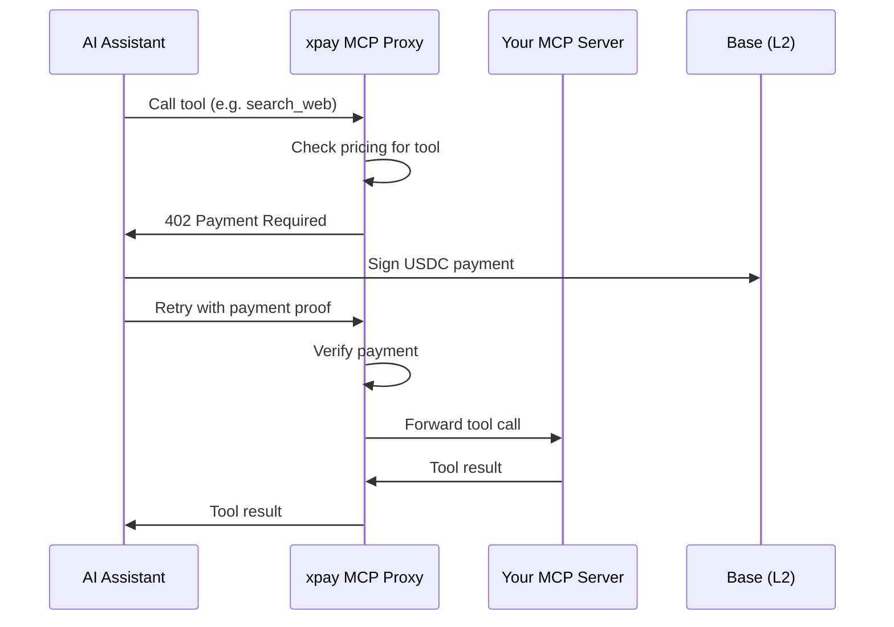

# MCP Monetization

Monetize any MCP (Model Context Protocol) server with pay-per-tool-call billing. Wrap your existing MCP server with an xpay proxy and start earning from every tool invocation.

## Overview

MCP Monetization lets you place a payment layer in front of any MCP server. When an AI assistant (Claude, Cursor, Windsurf, etc.) calls a tool on your server, the payment is processed automatically via the x402 protocol before the tool executes.

- **Zero code changes** - Your MCP server stays exactly as it is
- **Per-tool pricing** - Set different prices for different tools
- **Instant payouts** - Revenue flows directly to your wallet via USDC
- **Works everywhere** - Compatible with any MCP client

## How It Works



1. You register your MCP server URL on xpay and set per-tool pricing
2. xpay gives you a proxy URL: `https://{slug}.mcp.xpay.sh/mcp`
3. Users connect their AI assistant to the proxy URL instead of your server directly
4. Every tool call is metered and paid for automatically

## Quick Start

### 1. Register Your MCP Server

Go to [xpay.sh](https://www.xpay.sh) and create a new MCP monetization endpoint:

- **Server URL**: Your MCP server's SSE or Streamable HTTP endpoint
- **Receiving wallet**: Your USDC wallet address on Base
- **Pricing**: Set a default price per tool call, or configure per-tool pricing

### 2. Configure Per-Tool Pricing

Set different prices for each tool your server exposes:

| Tool | Price | Description |
|------|-------|-------------|
| `search_web` | $0.01 | Basic web search |
| `deep_research` | $0.10 | Multi-source research |
| `generate_report` | $0.25 | Full report generation |

You can also set a flat rate that applies to all tools.

### 3. Share Your Proxy URL

Give users your proxy URL to connect in their AI assistant:

```
https://my-service.mcp.xpay.sh/mcp
```

### 4. Connect in Claude Desktop

Users add your monetized MCP server to their `claude_desktop_config.json`:

```json
{
  "mcpServers": {
    "my-service": {
      "url": "https://my-service.mcp.xpay.sh/mcp",
      "headers": {
        "Authorization": "Bearer USER_API_KEY"
      }
    }
  }
}
```

### 5. Connect in Cursor / Windsurf

In Cursor or Windsurf settings, add the MCP server URL:

```
https://my-service.mcp.xpay.sh/mcp
```

The AI assistant will automatically handle x402 payments when calling tools.

## Pricing Configuration

### Flat Rate

Charge the same price for every tool call:

```json
{
  "pricing": {
    "model": "flat",
    "price": 0.05,
    "currency": "USDC"
  }
}
```

### Per-Tool Pricing

Set individual prices for each tool:

```json
{
  "pricing": {
    "model": "per_tool",
    "currency": "USDC",
    "tools": {
      "search": 0.01,
      "analyze": 0.05,
      "generate": 0.10
    },
    "default": 0.02
  }
}
```

The `default` price applies to any tool not explicitly listed.

## API Key Management

Buyers authenticate with an API key to track their usage and manage spending:

- **Get an API key** from [xpay.tools](https://xpay.tools)
- **Include it** in the `Authorization` header when connecting to the MCP proxy
- **Track usage** and spending in the xpay dashboard
- **Set spending limits** to control costs

## Billing Receipts

After each tool call, the proxy includes billing metadata in the response:

```json
{
  "result": { "...tool output..." },
  "_billing": {
    "tool": "search_web",
    "cost": "0.01",
    "currency": "USDC",
    "txHash": "0xabc...",
    "network": "base",
    "timestamp": "2026-02-22T10:30:00Z"
  }
}
```

## Supported MCP Transports

- **Streamable HTTP** (recommended) - Modern HTTP-based transport
- **SSE (Server-Sent Events)** - Legacy streaming transport

## Use Cases

- **Data providers** - Monetize search, enrichment, and lookup tools
- **AI model wrappers** - Charge per inference via MCP tools
- **SaaS integrations** - Expose your product's API as paid MCP tools
- **Research services** - Charge for web scraping, analysis, and report generation

---

Ready to monetize your MCP server? See our [step-by-step publishing guide](/tools/publish) or explore the [x402 Protocol](/x402-protocol) to understand the payment layer.
