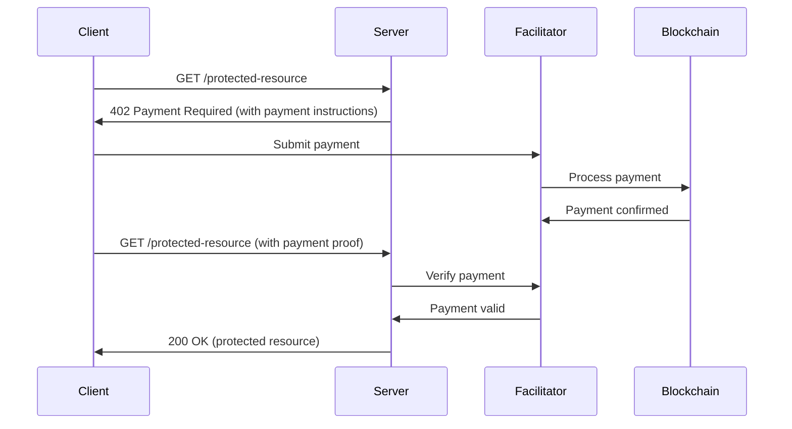

# x402 Protocol Overview

The x402 protocol revives the HTTP 402 "Payment Required" status code, enabling instant, automatic stablecoin payments directly over HTTP. It's the foundation that makes autonomous agent payments and API monetization possible.

## What is x402?

x402 is an open payment protocol that extends HTTP to support native payments. When a client requests a protected resource, the server can respond with `402 Payment Required` along with payment instructions. The client can then submit payment and retry the request.

### Key Benefits

- **💰 Micropayments**: Pay per API call, token, or second of usage
- **⚡ Instant Settlement**: Payments settle in ~2 seconds on blockchain
- **🤖 Agent-Native**: Designed for autonomous machine-to-machine payments
- **🌐 Universal**: Works with any HTTP client or server
- **🔗 Chain Agnostic**: Supports Ethereum, Base, Polygon, and more

## How It Works



### Basic Flow Example

1. **Request**: Client requests a protected resource
   ```http
   GET /api/premium-data HTTP/1.1
   Host: api.example.com
   ```

2. **Payment Required**: Server responds with payment instructions
   ```http
   HTTP/1.1 402 Payment Required
   Content-Type: application/json
   
   {
     "type": "x402",
     "amount": "0.10",
     "currency": "USDC",
     "facilitator": "https://facilitator.xpay.sh",
     "recipient": "0x742d35Cc6635C0532925a3b8D"
   }
   ```

3. **Payment**: Client submits payment to facilitator
   ```typescript
   const payment = await facilitator.pay({
     amount: "0.10",
     currency: "USDC", 
     recipient: "0x742d35Cc6635C0532925a3b8D"
   })
   ```

4. **Access**: Client retries request with payment proof
   ```http
   GET /api/premium-data HTTP/1.1
   Host: api.example.com
   X-Payment-ID: payment_abc123
   ```

## Core Components

### Facilitators

Facilitators handle the blockchain complexity so developers don't have to:

- **Payment Processing**: Submit transactions to blockchain
- **Verification**: Confirm payments without revealing private keys
- **Settlement**: Transfer funds to recipients
- **Standards**: Ensure interoperability between implementations

Popular facilitators:
- [xpay Facilitator](https://facilitator.xpay.sh) - Free, supports Base mainnet + Sepolia, v1 and v2
- [Coinbase Developer Platform](https://docs.cdp.coinbase.com/x402/)
- [Base Facilitator](https://facilitator.base.org)

### Payment Instructions

Servers include payment details in 402 responses:

```json
{
  "type": "x402",
  "amount": "0.05",           // Price in USD or token units
  "currency": "USDC",         // Payment token
  "facilitator": "https://facilitator.xpay.sh",
  "recipient": "0x...",       // Receiving wallet address
  "memo": "API access",       // Optional payment description
  "expires": "2024-01-01T00:00:00Z"  // Payment expiration
}
```

### Payment Verification

Servers verify payments before granting access:

```typescript
import { X402Facilitator } from '@x402/sdk'

const facilitator = new X402Facilitator('https://facilitator.xpay.sh')

async function verifyPayment(paymentId: string) {
  const payment = await facilitator.verify(paymentId)
  
  if (payment.status === 'completed' && payment.amount >= requiredAmount) {
    return true
  }
  return false
}
```

## Protocol Specifications

### Status Codes

- **402 Payment Required**: Payment needed to access resource
- **200 OK**: Payment verified, resource accessible
- **400 Bad Request**: Invalid payment format
- **409 Conflict**: Payment already processed
- **410 Gone**: Payment expired

### Headers

Standard headers for x402 payments:

```http
# Request headers
X-Payment-ID: payment_abc123
X-Payment-Token: eyJ0eXAiOiJKV1QiLCJhbGc...

# Response headers  
X-Payment-Required: x402
X-Payment-Amount: 0.10
X-Payment-Currency: USDC
X-Payment-Facilitator: https://facilitator.xpay.sh
```

## Use Cases

### API Monetization

Transform any API into a revenue stream:

```typescript
app.get('/api/ai-completion', requirePayment(0.05), (req, res) => {
  // Only runs after $0.05 payment
  const completion = await openai.createCompletion(req.body)
  res.json(completion)
})
```

### Agent Spending Controls

Protect autonomous agents from overspending:

```typescript
const agent = new Agent({
  spendingLimits: {
    maxPerRequest: 1.00,
    maxDaily: 100.00
  }
})

// Agent automatically handles x402 payments within limits
await agent.callAPI('https://expensive-ai-service.com/api')
```

### Content Paywalls

Monetize digital content per view:

```typescript
// Pay $0.01 to read this article
app.get('/article/:id', requirePayment(0.01), (req, res) => {
  const article = getArticle(req.params.id)
  res.json(article)
})
```

### Machine-to-Machine Commerce

Enable IoT devices to pay for services:

```typescript
// Smart car pays for traffic data
const trafficData = await iotDevice.x402Request('/traffic-api', {
  payment: { amount: 0.001, currency: 'USDC' }
})
```

## Network Support

x402 works on multiple blockchain networks:

| Network | Currency | Settlement Time | Gas Costs |
|---------|----------|----------------|-----------|
| Base Mainnet | USDC | ~2 seconds | ~$0.001 |
| Base Sepolia | USDC | ~2 seconds | Free |
| Ethereum | USDC, ETH | ~12 seconds | ~$2-20 |
| Polygon | USDC, MATIC | ~2 seconds | ~$0.01 |

## Getting Started

Ready to integrate x402 payments?

1. **[Installation](/getting-started/installation)** - Set up the x402 SDK
2. **[xpay Facilitator](/x402-protocol/facilitator)** - Verify and settle x402 payments on Base
3. **[Production Deployment](/getting-started/production-deployment)** - Configure production-ready deployments

## Resources

- **[Official Specification](https://x402.org)** - Complete protocol documentation
- **[Coinbase x402 Docs](https://docs.cdp.coinbase.com/x402/)** - Coinbase's implementation guide
- **[awesome-x402](https://github.com/xpaysh/awesome-x402)** - Community resources and tools
- **[x402 Foundation](https://x402.org/foundation)** - Protocol governance and standards

---

Continue reading: [xpay Facilitator](/x402-protocol/facilitator)